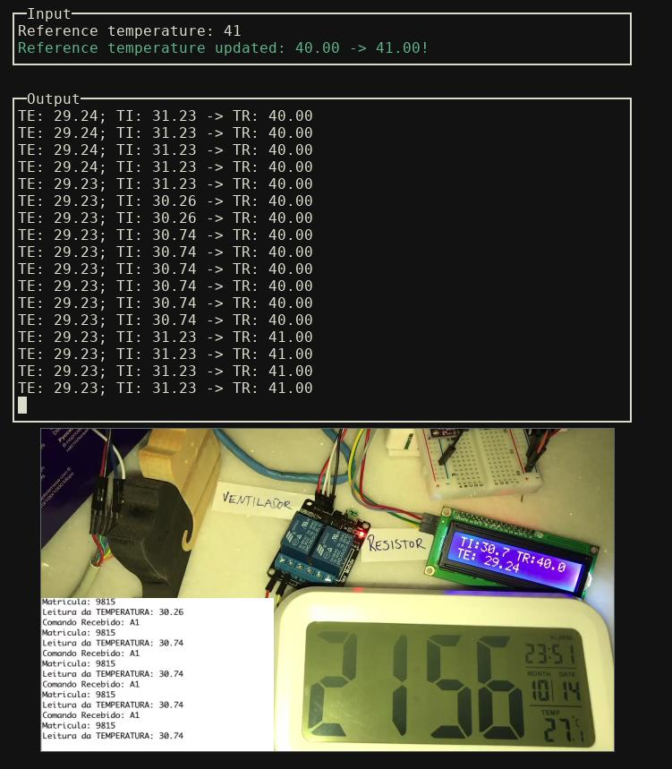

# Embedded Systems - Control temperature on/off

The objective of this application is to control the temperature, inside a controlled environment, using an on/off mechanism: a resistor heats the environment while a cooler chill it, the control is done turning them on or off. The whole mechanism is described with more details in this [description](https://gitlab.com/fse_fga/projetos/projeto-1).

## Demonstration

The application in execution (and window from the live with the equipment):



## Relevant attributes

|Abbreviation|Attribute            | Description                                      |
|:----------:|---------------------|--------------------------------------------------|
|TI          |Internal Temperature | Temperature inside the controlled environment    |
|TE          |External Temperature | Temperature of the room                          |
|TR          |Reference Temperature| Temperature which the system will try to achieve |

## Features

* Hysterisis input by user
* Runtime update of desired temperature through keyboard or potentiometer
* CSV generation with recorded values
* LCD display shows values
* Terminal shows values

## Building

The code was developed and tested in a Raspberry Pi.

### External dependencies

These are dependencies which are not cloned with this repository:

* [WiringPi](http://wiringpi.com/download-and-install/)
* [ncurses](https://www.google.com/search?hl=en&q=install%20ncurses)

### Building

1. Clone the repository:

``` bash
git clone --recursive https://github.com/icaropires/embedded-temperature-on-off
```

2. `cd` into project's dir and build it:

``` bash
cd embedded-temperature-on-off
make
```

## Running

At the project root:
``` bash
make run
```

A file `errors.log` will be created to keep possible error messages to `stderr`.
